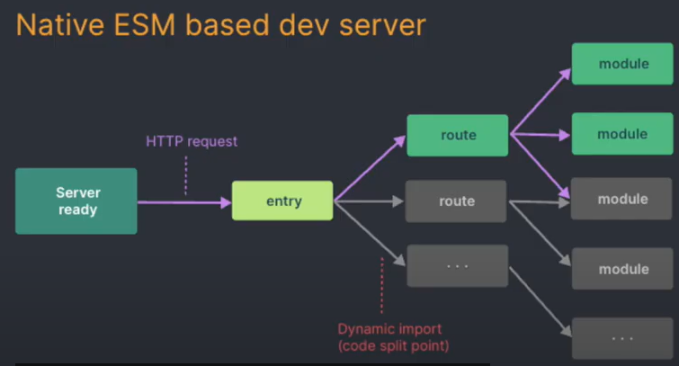

# `Vue 3 CompositionAPI 예제 프로젝트`

# Composition API(3.1) 소개
<details>
<summary>펼치기/접기</summary>
<br>

## Composition API란?
기존 문법을 간결하게 다루게 해준다.  
vue 3.1 버전 이상에서 도입된 Composition API의 더욱 간소화된 문법을 소개한다.  
새로운 빌드 도구인 vite에서 기본 템플릿으로 제공하고 있다.  
공식 문서에서도 Composition API 사용을 권장하고 있다.  
주요 개선사항으로는 setup 기능으로 스크립트 작성 규칙을 단순화 시켰으며, 컴포넌트 관련 항목들, name, components 등 옵션등을 일일히 구분하지 않아도 된다.  
또한 export default 이하 데이터, 메소드, watch 등 또한 마찬가지로 따로 구분 필요 없이 한 곳에 작성 가능하다.  
상태 변수를 작성하는 문법이 변경되었으며, ref() 함수를 이용해 관리할 수 있다.  
라이프사이클 같은 경우도 함수로 작성하면 되며, onMounted로 이르만 변경되었다.

### 주요 개선 사항 정리
- setup 기능으로 스크립트 작성 규칙 단순화
- 옵션을 따로 구분할 필요 없이 한곳에서 작성
  - export default 이하 data, method, watch 등 구분 필요 없이 한곳에 작성 가능
- ref()로 상태변수 관리
- depfineProps로 prop 관리
### 실제 개선된 내용 코드 예시
- AS-IS
  ```vue
  <script>
    export default {
      name: 'AppComponent',
      data() {
        return {
          name: "APP",
          count: 0
        }
      },
      methods: {
        addCount() {
          count.value += 1;
        }
      },
      mounted() {
        console.log('mounted')
      },
    }
  </script>
  ```
- TO-BE
  ```vue
  <script setup>
    import { ref, onMounted } from 'vue';
    let name = ref('App');
    let count = ref(0);
    onMunted(() => {
      console.log('mounted')
    })
  </script>
  ```
</details>
<br>

# Vue3 CLI 프로젝트 설치 및 기동
<details>
<summary>펼치기/접기</summary>
<br>

## 필수 요소
- Node.js (LTS)
- IDE: VSC 등

## 터미널 
- vue/cli 설치 명령어 입력
  ```bash
  npm install -g @vue/cli
  ```
- Vue 프로젝트 생성
  ```bash
  vue create {프로젝트명}
  ```
- Vue 버전 선택 - 첫번째 Vue3 선택
  ```bash
  ? Please pic a preset: (Use arrow keys)
  > Default ( [Vue 3] babel, eslint)
    Default ( [Vue 2] babel, eslint)
    Manually select features
  ```
- 설치 완료 후 최종 터미널 통합 출력 내용
  ```bash
  Generating README.md...  

  Successfully Created project movie-info.  
  Get started with the following commands:  
  ```
- VSC 실행
  ```bash
  code .
  ```
- vue 프로젝트 node 개발서버 실행
  ```bash
  npm run serve
  ```
</details>
<br>

# Vite 빌드 툴 소개
<details>
<summary>펼치기/접기</summary>
<br>

Vue3로 넘어가면서 프로젝트를 만들고 빌드하던 기존 vue cli 대신 Vite를 사용할 수 있다.  
Vite는 FrontEnd 개발 툴로 Vue 뿐만 아니라 React등 다른 FrontEnd 개발 어디서든 사용이 가능하다.  
기존 Vue CLI와 마찬가지로 개발용 서버 기능과 배포를 위한 빌드 기능을 제공한다.  
Vite를 쓰는 이유는 배포를 위한 과정에서 코드를 통합하는 번들링 과정이 필요하며, 이때 기존과 다르게 `Naitve`(Naitve ESM based dev server) 방식으로 처리되어 구동 속도가 매우 빠르다.


</details>
<br>

# Vue3 Vite 프로젝트 설치 및 기동
<details>
<summary>펼치기/접기</summary>
<br>

## 필수 요소
- Node.js (LTS)
- IDE: VSC 등

## 터미널 
- 설치 명령어 입력
  ```bash
  vue create vite@latest
  ```
- 프로젝트명 입력
  ```bash
  √ Project name: ... vue-simple-basic
  ```
- framework 선택 : 2번째 vue 선택
  ```bash
  ? Select a framework: » - Use arrow-keys. Return to submit.
      Vanilla
  >   Vue
      React
      Preact
      Lit
      Svelte
      Solid
      Qwik
      Angular
      Others
  ```
- 사용 언어 선택
  ```bash
  ? Select a variant: » - Use arrow-keys. Return to submit.
      TypeScript
  >   JavaScript
      Official Vue Starter ↗
      Nuxt ↗
  ```

- 설치 완료 후 최종 터미널 통합 출력 내용
  ```bash
  PS C:\Programming\workspace_vs> npm create vite@latest
  Need to install the following packages:
    create-vite@6.2.0
  Ok to proceed? (y) y
  √ Project name: ... {프로젝트명}
  √ Select a framework: » Vue
  √ Select a variant: » JavaScript

  Scaffolding project in C:\Programming\workspace_vs\vue-simple-basic...

  Done. Now run:

    cd vue-simple-basic
    npm install
    npm run dev
  ```

- VSC 실행
  ```bash
  code .
  ```
- node module 패키지 설치
  ```bash
  npm install
  ```
- vue 프로젝트 node 개발서버 실행
  ```bash
  npm run dev
  ```
</details>
<br>

# 템플릿
<details>
<summary>펼치기/접기</summary>
<br>

</details>
<br>